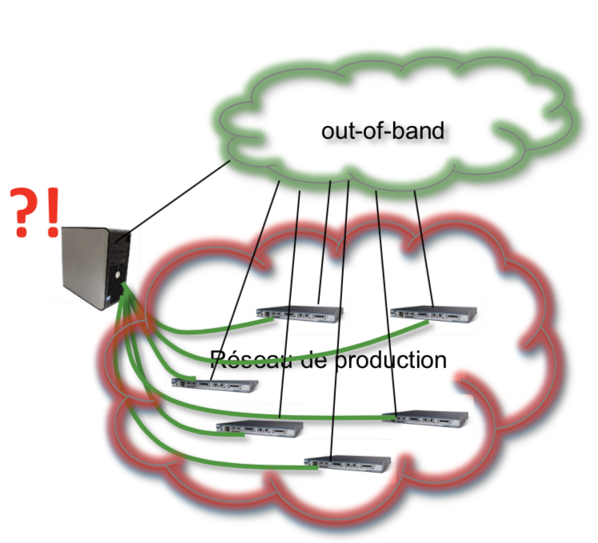
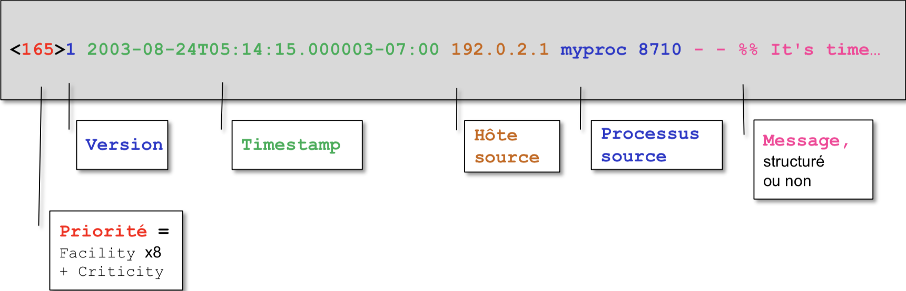
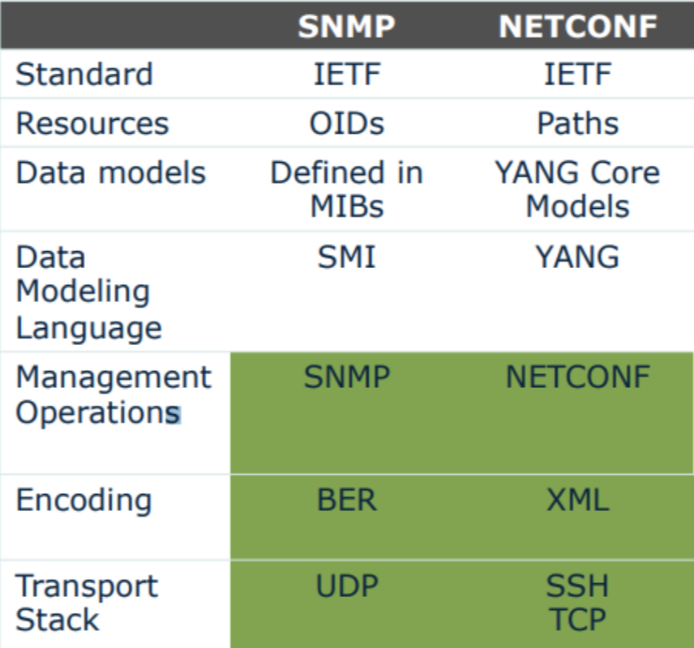

# GRX — Résumé

## Introduction

* Infrastructure découpée en 3 domaines :
  * application (serveur HTTP, db, ...)
  * systèmes (Linux, Windows, ...)
  * réseaux (ethernet, IP, TCP, ...)

* **Telecommunications Management Network** (TNM) : architecture pour la gestion de d'équipements, de réseaux et de services.
  * Network Element (NE) : les éléments du réseaux,
  * Element Management (EM) : la gestion de chaque élément du réseau,
  * Network Management (NM) : la gestion des éléments *en* réseau.

* Modèle **OAM&P** : fait références aux activités, méthodes, procédures et outils qui concerne la gestion, l'administration, la maintenance et l'approvisionnement de systèmes réseaux.
  * **Operation** : maintenir le réseau et ses services dans un état fonctionnel, inclus la surveillance du réseau pour détecter des problèmes le plus tôt que possible.
  * **Administration** : suivre les ressources du réseau et leur utilisation afin que tout soit sous contrôle.
  * **Maintenance** : inclus la réparation et la mise à jour des éléments du réseau, peut être autant correctif que préventif.
  * **Provisioning** : concerne la configuration des ressources du réseau afin de supporter un certain service.

* But de la gestion des réseaux :
  1. surveiller les performances,
  2. surveiller le fonctionnement des équipement,
  3. gérer les configurations des équipements (mise en prod, backup, ...),
  4. gérer les inventaires matériels et logiciels,
  5. répartir les ressources et assurer la qualité des réseaux,
  6. facturer la consomation des réseaux
* Modèle **FCAPS** : Fault, Configuration, Accounting, Performance & Security.
* **Total Cost of Ownership** (TCO) : le coût de fonctionnement d'un réseau est partagé entre le coût matériel et opérationnel (personnel, électricité, ...).
* **Qualité de service** (QoS) : notion liée aux performance attendue d'un système pour que ses services fonctionnent correctement. S'oppose à la **qualité d'expérience** (QoE) : perception des performances globales du point de vue de l'utilisateur. Critères :
  * bande passante,
  * délai de transmission
  * régularité
  * perte de paquets

* La gestion des équipements du réseau comprend :
  1. alarme en cas de pannes matérielles ou logicielles,
  2. alarme en cas d'événement atypique ou prédéfinis,
  3. gestion des configurations des équipements,
  4. gestion des mises à jour des équipements,
  5. gestion du trafic et définition de règles,
  6. découverte des équipements (cartographie réseau),
  7. statistiques.

* La plupart des systèmes et applications génèrent des informations (**logs**) quant à leur fonctionnement. Peuvent être affichés à l'écran, stockés dans des fichiers, transmis ailleurs. Différents niveaux d'information : erreur, avertissement, notification, ...
* Certains systèmes peuvent aussi informer sur leur **état** : utilisation du processeur, température d'un composant, ...
* Un **seuil** = valeur « normale » ± marge.
* La gestion des éléments d'un réseau repose sur :
  * la lecture passive des informations générées par les éléments,
  * la demande explicite et active d'informations de ces éléments (état, ...).
* La quantité d'information peut être très importante, il faut les corréler pour savoir lesquelles sont importantes et éviter les faux positifs.

## Technologies

* syslog, snmp, rmon, wmi, netconf, netflow

* Ces technologies implémentent :
  1. des agents (aka client), e.g. un agent hébergé sur un router,
  2. un gestionnaire (aka serveur), e.g. un logiciel sur un serveur,
  3. un protocole de communication, e.g. SNMP.
  
* Les horloges des différents émetteurs doivent être synchronisées, e.g. avec Network Time Protocol (NTP).

* Management **in-band** : gestion du réseau via telnet ou ssh (par exemple), utilise le réseau lui-même. Si le réseau est indisponible, sa gestion le sera aussi.

* Management **out-of-band** : la gestion du réseau passe par un réseau dédié.

  

* Fonctionnalités des **Network Management System** (NMS) :
  * aggrégation d'alarmes,
  * définition automatique de seuils d'alarmes,
  * auto-decouverte des équipements des réseaux,
  * interrogation des équipements,
  * cartographie des réseaux,
  
* Un équipement réseau peut être géré ou configuré via :
  * une console locale (via un port série),
  * une console distante (via telnet ou ssh),
  * remote commandes (rsh ou rcmd),
  * une interface graphique native,
  * une interface web.

### Syslog

* **Syslog** (System Logging Protocol, RFC 5424) permet de collecter et trier des événements au sein de fichiers logs centralisés. Envoi de messages de manière asynchrone et autonome. Différentes sources possibles :
  
  * `klogd` (noyau),
  * `/dev/log` (socket local, utilisation d'une API),
  * réseau.
  
* Syslog est aussi un système client–serveur. Port UDP 514 utilisé.

* Sécurité : messages ni chiffrés ni authentifiés, possibilité d'envoyer des faux messages.

* Les messages syslog sont formatés :
  1. **Header**
     1. **Priority** = `Facility` + `Criticity`
        1. `Facility` (source) : 24 codes possibles peuvent être associés aux processus émetteur de l'événement, e.g. kern, user, mail, daemon, auth, ...
        2. `Criticity` (gravité) : 8 niveaux possibles, i.e. emerg, alert, crit, err, warning, notice, info, debug.
     2. **Version**
      3. **Timestamp**
     4. **Hostname**
     5. **Process name**
     6. **Process id**
     7. **Message id**
  2. **Structured data** : id + param
  3. **Message** : texte libre
  
  
  
* `syslog.conf` contient les règles de traitement des événements reçus :

  ```
  origine du message    destination du message
  facility.criticity    destination
  
  daemon.*              /var/log/daemon.log (fichier)
  user.crit             @adr_ip_serveur_log (serveur)
  kern.*                /dev/console (console)
  mail.info             /var/log/mail.info
  ```
  
* Un message syslog peut être généré avec la commande `logger`.

* Directive Apache pour générer des événements syslog : `ErrorLog syslog:local3` (`local3` : une des 24 facilities possibles).

* Commandes IOS :

  ```
  Router(config)# ntp server x.x.x.x
  Router(config)# service timestamps log datetime msec
  Router(config)# logging x.x.x.x                (@IP serveur syslog)
  Router(config)# logging trap level             (0-7, defaut : 0 -> 6)
  Router(config)# logging facility facility-type (local7 par défaut)
  Router# show logging
  Router# clear logging
  ```

### MS Event Viewer

* Sous Windows, les fichiers logs sont sous forme binaire (.evt, .evtx) dans le répertoire `%SystemRoot%\System32\Winevt\Logs`.
* Event Viewer (`eventvwr.exe`) est l'outil d'aggrégation et d'affichage des événements et des alarmes (locaux ou distants). `psloglist.exe` pour les avoir sous format texte.
* `eventcreate.exe` pour créer un événement dans un .evtx. PowerShell : `New-EventLog` et `Write-EventLog`.
* Passerelles entre EventViewer et syslog possibles.

### SNMP

* Simple Network Management Protocol (RFC 1157) permet la gestion standardisée et distante d'équipements réseaux. Autant un protocole qu'une architecture client–serveur.
  * un agent tourne sur un équipement et interagit avec son matériel et logiciels,
  * une console interroge l'agent et collecte les informations,
  * le protocole SNMP (UDP: ports 161 et 162) assure la communication entre la console et les agents.
* La v2 est la plus utilisée, la v3 la plus récente.
* Fonctionnalités :
  1. **interrogation** des agents afin d'avoir des informations ou propriétés d'un équipement réseau,
  2. **configuration** d'un équipement via l'agent,
  3. **collecte** de *traps* (alarmes) envoyées par un agent par l'intermédiaire d'une console de collecte. Envoi asynchrone et autonome déclenché sur la base d'un seuil ou d'un événement. Une action (envoi de mail, script) peut être déclenchée à ce moment là.
* Opérations :
  * **GET**, **WALK** : récupération de une ou plusieurs données,
  * **SET** : modification de données ou paramètres,
  * **TRAP** : envois d'alarmes.
  * *Note* : mal adapté pour les modifications massives.
* Version 2 : méchanisme d'authentification basique avec les *community strings* définissant deux types d'accès : *public* (read-only) et *private* (read and write). Transmises en clair. Prévoir un VLAN de management pour autoriser les consoles à accéder aux agents.

* Version 3 : remplacement des *community strings* par 3 modes d'authentification :

  * **noAuthNoPriv** : pas d'authentification, pas de chiffrement,
  * **authNoPriv** : authentification HMAC-MD5 ou SHA, pas de chiffrement,
  * **authPriv** : authentification HMAC-MD5 ou SHA, chiffrement DES 54-bits.
  * *Note* : pas implémenté par tous les équipements.

* Les données accessibles par SNMP sont modélisées par l'intermédiaire d'un **schéma** (assure l'interopérabilité entre agents et console). Le schéma est contenu dans une **MIB** (Management Information Base).

* La MIB est une base de données en arborescence et définit des objets (**Managed Objects**—MO) supportés par un agent. Stockée dans des fichiers textes structurés. Une partie de la MIB est standard à tous les équipements. Possibilité d'extension par les fabricants d'équipements (MIB privées).

* Chaque objet est définit par un **ID**, des **attributs** (données) et des **méthodes** (actions) qui peuvent y être appliquées (modèle SMI, syntaxe ASN.1). Correspondance entre la MIB à disposition de la console et les objets réellement implémentés dans l'agent.

* Les *traps* doivent être définies dans la MIB.

* Des mesures de sécurité additionnelles sont nécessaires :

  * contrôle d'accès sur les équipements via ACL (seul la console doit pouvoir interroger l'équipement),
  * utilisation d'un reseau de management isolé (VLAN à part),
  * restriction du protocole SNMP aux sources autorisées.

* Commandes IOS :

  ```
  Router(config)# ntp server x.x.x.x
  Router(config)# service timestamps log datetime msec
  Router(config)# snmp-server community chaîne1 RO aclX
  Router(config)# snmp-server community chaîne2 RW aclX
  Router(config)# snmp-server enable traps …
  Router(config)# snmp-server host x.x.x.x chaîne3
                  avec aclX = access-list
  Router# show snmp mib
  Router# show snmp host
  ```

### RMON

**Remote Monitoring** (RFC 2819, 2021) est une extension du protocole SNMP. Utilise ses propres MIBs. Une sonde RMON (*tap*) collecte des informations de type statistique.

### CIM

* Le modèle CIM (**Common Information Model**) permet la représentation d'objets informatiques (tout comme SNMP). Utilisé principalement par Microsoft.
* Un objet peut être du matériel, du logiciel, etc. Un objet à une **classe** qui définit ses **propriétés**. Il est manipulé par des **méthodes** et est référencé/adressé par son **namespace**.
* Fait appel à :
  * des agents composés de *providers* (objet en surveillant d'autres) et de *managed objects* (disques dur, cartes réseau, etc.),
  * des gestionnaires (*consumers*).
* Basé sur 3 niveaux de schémas conceptuels :
  * **Core schema** : implémenté par tous les agents,
  * **Common schema** : implémenté par les agents d'un même type (e.g db, app),
  * **Extension schema** : propre à un fabricant.
* Les schémas sont décrit avec le format **MOF** (Managed Object File) de type UML.
* Relations entre CIM et SNMP possibles.

### WMI

* **Windows Management Instrumentation** (WMI) est l'implémentation Microsoft du modèle CIM. Schéma CIM étendu par le schéma Win32. Namespace `CIMv2/ms_409` pour l'anglais et `CIMv2/ms_40c` pour le français. Données manipulées par un langage de type SQL : WQL.

* `net start winmgmt` permet de démarrer le service WMI.
* `winmgmt.exe` permet de gérer le service en mode graphique, `wmic.exe` en mode console. PowerShell : `Get-WmiObject` et `Get-CimInstance`.
* `wbemtest` permet de tester l'infrastructure WMI. WBEM (Web-Based Enterprise Management) utilise le protocole HTTP.

### Cisco Netflow

Permet d'exporter depuis un router des informations statistiques sur les flux IP traités par une interface (IP source, dest ; port source, dest ; interface). Utilise UDP. Exploite le contenu des caches « route switching » des routeurs Cisco. Standard IPFIX. Collecteur de flux et outils d'analyse requis.

```
# activer l'export sur une interface d'un router
interface fa0/0
ip flow {ingress | egress}

# voir le contenu du cache Netflow sur un router
Router# show ip cache flow

# vérifier les données exportées
Router# show ip flow export
```

### NETCONF

* Mécanise (RFC 6241) destiné à l'industrialisation des configurations d'équipements. Vise à remplacer SNMP pour la configuration des équipements. Basé sur YANG ou JSON. Différents protocoles possibles : RPC, SSH, SOAP, BEEP, etc. Mode client–serveur. Permet de roll-back une config grâce au datastore. Port 820 chez Cisco.
* Implémente des **opérations** permettant de transmettre un **contenu** (format XML, modèle YANG) transporté via des **messages** RPC (protégé par SSH) : get, get-config, edit-config, lock, unlock, kill-session, etc.
* **YANG** est le langage de modélisation de NETCONF, il remplace le modèle SMI utilisé par SNMP pour les MIB en tant que DDL (Data Definition Language). Données de configuration et données d'état. Données typées. Définit des modules.
* Peut émettre des messages en cas d'événement. Il faut faire une souscription auprès du client NETCONF.
* RESTCONF implémente YANG mais avec REST. HTTP plutôt que RCP. Moins supporté.
* Commandes IOS :
  ```
  # prérequis : configuration d'un utilisateur privilège 15
  Router(config)# netconf-yang
  Router(config)# netconf-yang feature candidate-datastore
  ```



### Nagios

* Plateforme open-source fournissant les principales technologies de gestion, e.g. SNMP, syslog, WMI. Programme modulaire composé de 3 couches : Nagios Core (open-source), Nagios XI (UI, payant), plugins (nombreux).

* Possibilité d'ajouter un agent spécifique sur la cible pour une meilleure gestion (NCPA).
* Monitoring passif (SNMP traps, ...) ou actif (SNMP Get, ...).