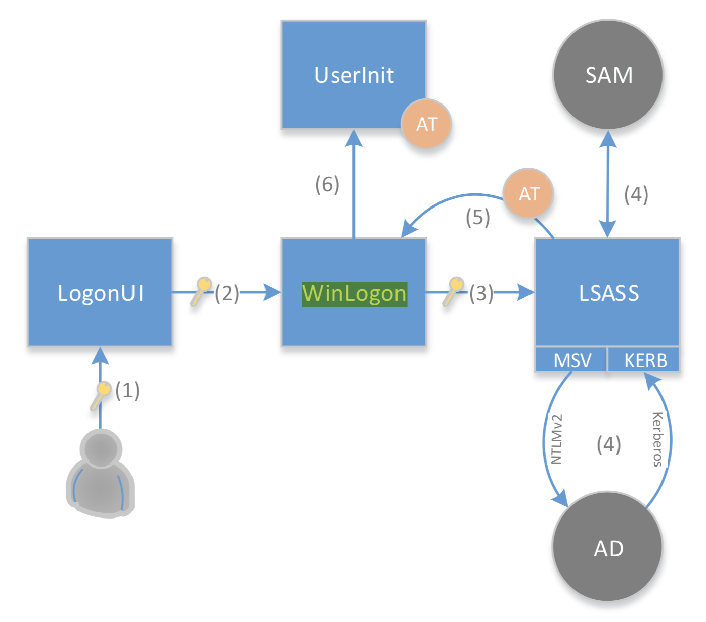
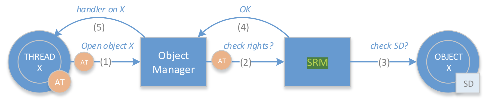
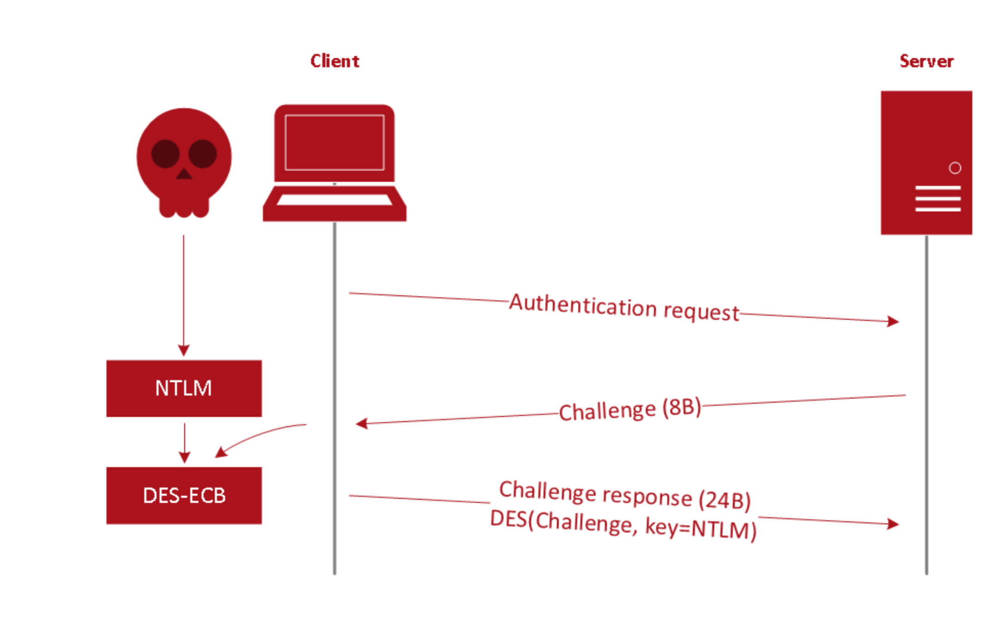
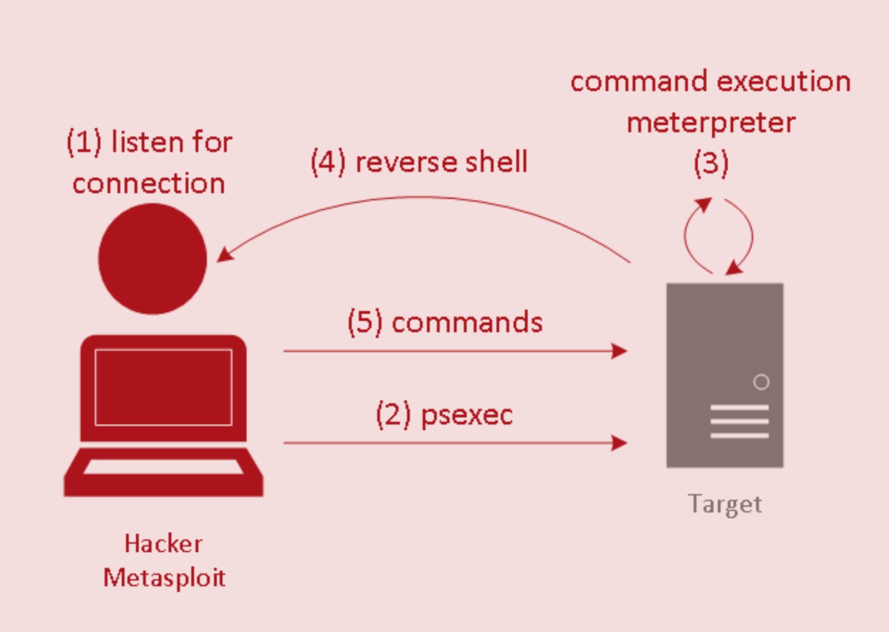
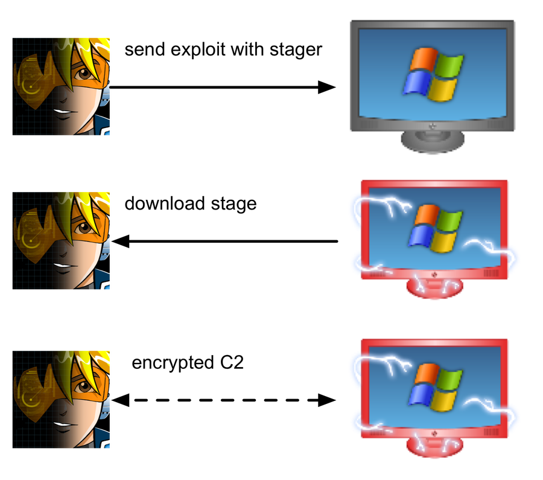

# 1

Winlogin permet la coordination de l'authentification (qui est effectuée par LSASS) ainsi que la création et la gestion de session.

LSASS permet d'authentifier les utilisateurs et émet les Access Token après une authentification réussie.

L'Access Token est délivré à l'utilisateur qui s'est authentifié. Il a une portée local, il est utilisé par Windows pour effectuer des descisions relative au contrôle d'accès, il est transmis aux processus et threads enfants. Il contient le SID de l'utilisateur, son groupe, ses droits et ses privilèges.

# 4 et 6

LSASS repose sur l'utilisation de paquetages d'authentification (qui sont des DLL) aussi appelés Security Support Packages. Les plus communs sont :

* MSV pour le support de l'authentification legacy utilisant LM/NTLM.
* Kerberos pour l'authentification Kerberos.
* TsPkg pour l'authentification RDP (Remote Desktop Sharing).
* WDigest pour l'authentification en SSO avec HTTP. Le mot de passe est exposé en clair. Possible de le désactiver depuis 2014 (clef de registre UseLogonCredential).

# 3

EternalBlue est une vulnérabilité critique du protocole SMB v1.0 permettant l'exécution de code arbitraire. MS17-010 est le nom du correctif de sécurité correspondant (mars 2017).

# 1 et 3

Le Security Reference Monitor (SRM) vérifie les autorisations suite aux requêtes de l'Object Manager (?). Le SRM ne vérifie que les droits d'accès. Il compare l'Access Token à l'Access Control List (Security Descriptor) (?) et à l'Integrity Level (?).

# 6

Les Logon Types indiquent comment se déroule l'authentification. Le mot de passe n'est pas toujours conservé en mémoire (LSASS), c'est le cas du Logon Type 3 (network). Les Logon Types communs sont :

* Interactive (2) : login depuis le clavier.
* Network (3) : login depuis une autre machine sur le réseau.
* Unlock (7) : déverouillage d'une machine.
* Remote Interactive (10) : login via remote desktop.
* Cached Interactive (11) : login depuis le clavier (MSCACHE).

# 4

LAN Manager Hash (LM Hash) est un algorithme de hashage de mots de passe très faible (bruteforcable en quelques heures). Ses principales faiblesses sont :

* Caractères convertis en majuscules.
* Alphabet de 95 caractères.
* Longueur maximale de 14 caractères. Si inférieur, complété par des caractères nuls.
* Le résultat est la concaténation du hash des 7 premiers caractères avec celui des 7 suivants :
    * beaucoup plus facile à bruteforcer (2 * 95 ^ 7 vs 95 ^ 14),
    * permet d'identifier les mot de passe de moins de 7 caractères (car la deuxième partie est constante).

Remplacé par le NT LAN Manager Hash (NTLM Hash) qui est aussi très faible. Est aussi vulnérable à l'attaque Pass-the-hash rendant inutile le bruteforçage du hash. La connaissance du hash NTLM est suffisante pour produire la réponse challenge demandée par le serveur. Ne peut pas être desactivé pour des raisons de compatibilité.

# 1

Quelques privilèges :

* Debug system processes (SeDebugPrivilege)
    * permet à Mimikatz de récupérer les mots de passe stockés en mémoire
* Shutdown the computer (SeShutdownPrivilege)
* Change date and time (SeSystemtimePrivilege)
* Use another access token (SeImpersonatePrivilege)
    * permet de récupérer des Access Token (utilisé avant l'apparition de Mimikatz).

Mimikatz est un outil développé par gentilkiwi et qui permet d'extraire les mots de passe (en clair et hashé), les codes PIN et les tickets Kerberos stockés en clair dans la mémoire. Mimikatz peut aussi exécuter une attaque pass-the-hash et pass-the-ticket ainsi que créer un Golden tickets.

# 3

Différents méchanismes permettent l'isolation des processus :

* Mandatory Integrity Controls (MIC) : isole les processus d'un même utilisateur. Limite l'accès en écriture. Basé sur les Integrity Levels. Existe depuis Vista.
* AppContainer : permet le sandboxing d'une application, étend les Integrity Levels pour pouvoir isoler une application du matériel, des fichiers, du registre, etc. Permissions spéciales avec les Capability. Peut être activé avec le flag de compilation /APPCONTAINER ou depuis les paramètres d'une application. Existe depuis Windows 8.
* Application Guard : isole Edge en utilisant la virtualisation. Existe depuis Windows 10. Un exploit kernel n'est plus suffisant pour bypass.
* Windows Sandbox : Application Guard mais pour d'autres application qu'Edge.

Différents niveau des Integrity Levels existants : Untrusted, Low, Medium, High & System.

# 4

À l'origine, psexec est un outil pour exécuter des commandes sur une machine Windows à distance. Utilise SMB pour mettre un binaire dans le share ADMIN$ puis crée un remote service qui l'exécute. Nécessite des identifiants valides.

Intégré comme module dans Metasploit et permet de déployer un shell Meterpreter en utilisant reverse_tcp ou bind_tcp comme payload.

Dans Metasploit, un payload correspond à un exploit module. Les 3 types principaux sont :

* Single : payload de taille limitée contenu dans un seul module.
* Stager : payload qui initie une connexion entre l'attaquant et la victime dans le but de télécharger un stage, de l'injecter en mémoire et de le faire exécuter. De petite taille et fiable.
* Stage : payload téléchargé par un stager. Permet d'avoir des fonctionnalités avancées sans limite de taille, e.g. Meterpreter.

